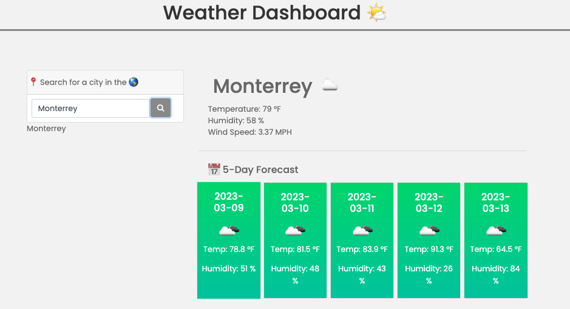

# Weather-dashboard 🌤️

## Index  
- [Description](#description)
- [Acceptance Criteria](#acceptance-criteria)
- [Installation](#installation)
- [Usage](#usage)
- [Technologies Used](#technologies-used)
- [Contributing](#contributing)
- [License](#license)
- [Contact](#contact)
- [Screenshot](#screenshot)

# Description
Weather Dashboard is a web application that allows users to view current and future weather conditions for any city they search. The app saves previous searches as clickable buttons for easy access to the weather information of specific cities. It uses the OpenWeather API to retrieve weather data for cities and localStorage to store any persistent data.

## Acceptance Criteria
- GIVEN a weather dashboard with form inputs
- WHEN I search for a city
- THEN I am presented with current and future conditions for that city and that city is added to the search history
- WHEN I view current weather conditions for that city
- THEN I am presented with the city name, the date, an icon representation of weather conditions, the temperature, the humidity, and the wind speed
- WHEN I view future weather conditions for that city
= THEN I am presented with a 5-day forecast that displays the date, an icon representation of weather conditions, the temperature, the wind speed, and the humidity
- WHEN I click on a city in the search history
- THEN I am again presented with current and future conditions for that city

## Installation
To run the Weather Dashboard application, follow these steps:

- Clone the repository to your local machine.
- Open index.html in your preferred web browser.

## Usage
To use the Weather Dashboard application, simply type the name of the city you want to see the weather information for in the search bar and hit enter or click the search button. The app will display the current weather conditions for the city, as well as a 5-day forecast. The app also saves previous searches as clickable buttons for easy access.

## Technologies Used
- OpenWeather API
- jQuery
- Bootstrap
- Moment.js
- Font Awesome
- localStorage

## Contributing
To contribute to the Weather Dashboard project, fork the repository and create a pull request with your changes. 

Please make sure to follow the code style of the project and include any necessary tests with your changes.

## License
This project is licensed under the MIT License. See the LICENSE file for more information.

## Contact
If you have any questions or concerns about the Weather Dashboard project, please contact me here mauricio.trevino91@gmail.com

## Screenshot

